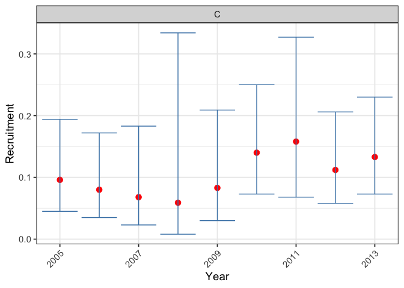
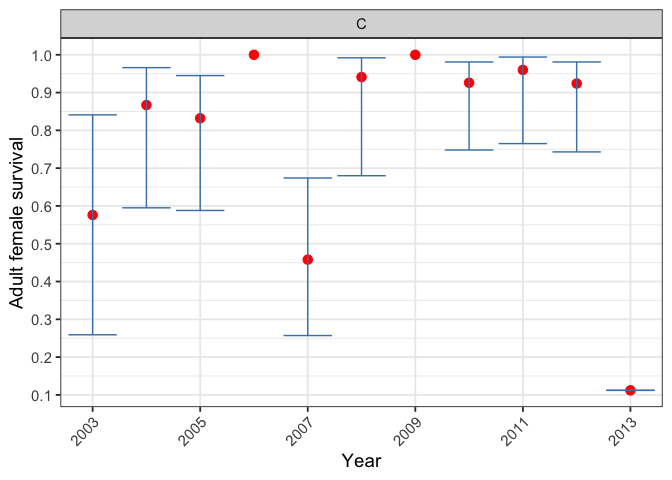
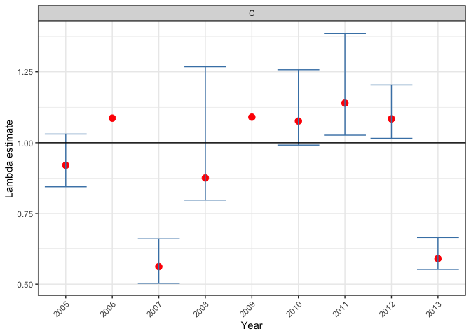
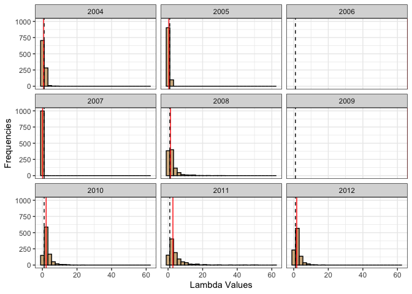

<!-- README.md is generated from README.Rmd. Please edit that file -->

# bbouretro

<!-- badges: start -->

[](https://github.com/poissonconsulting/bbouretro/actions/workflows/R-CMD-check.yaml)
[](https://app.codecov.io/gh/poissonconsulting/bbouretro?branch=main)
<!-- badges: end -->

## Introduction

The goal of bbouretro is to provide the ability to calculate survival,
recruitment and population growth using the classical methods.

## Installation

To install the latest development version from
[GitHub](https://github.com/poissonconsulting/bbouretro)

``` r
# install.packages("remotes")
remotes::install_github("poissonconsulting/bbouretro")
```

or alternatively using pak

``` r
# install.packages("pak")
pak::pak("poissonconsulting/bbouretro")
```

## Example

``` r
library(bbouretro)
library(bboudata)

# generate recruitment estimate for each year
recruitment_est <-
  bbr_recruitment(
    bbourecruit_c,
    pFemales = 0.65,
    sexratio = 0.5,
    variance = "binomial"
  )
bbr_plot_recruitment(recruitment_est)
```



``` r

# generate survival estimate for each year
survival_est <-
  bbr_km_survival(
    bbousurv_c,
    mort_type = "Total",
    variance = "Pollock"
  )
bbr_plot_survival(survival_est)
```



``` r

# calculate lambda now that both recruitment and survival have been calculated
lambda_est <- bbr_lambda_simulate(recruitment_est, survival_est)
summary <- bbr_lambda_summarize(lambda_est)
summary
#> # A tibble: 9 × 13
#>   PopulationName  Year     S     R Lambda SE_Lambda Lambda_LCL Lambda_UCL
#>   <chr>          <int> <dbl> <dbl>  <dbl>     <dbl>      <dbl>      <dbl>
#> 1 C               2005 0.832 0.096  0.92      0.052      0.838      1.04 
#> 2 C               2006 1     0.08   1.09     NA         NA         NA    
#> 3 C               2007 0.524 0.068  0.562     0.04       0.5        0.651
#> 4 C               2008 0.824 0.059  0.876     0.151      0.793      1.23 
#> 5 C               2009 1     0.083  1.09     NA         NA         NA    
#> 6 C               2010 0.926 0.14   1.08      0.062      0.987      1.23 
#> 7 C               2011 0.96  0.158  1.14      0.099      1.03       1.42 
#> 8 C               2012 0.963 0.112  1.08      0.051      1.01       1.22 
#> 9 C               2013 0.512 0.133  0.591     0.029      0.554      0.665
#> # ℹ 5 more variables: Prop_LGT1 <dbl>, meanSimSurv <dbl>, meanRsim <dbl>,
#> #   meanSimLambda <dbl>, medianSimLambda <dbl>
bbr_plot_lambda(lambda_est)
```



``` r
bbr_plot_lambda_distributions(lambda_est, "C")
```



## Contribution

Please report any
[issues](https://github.com/poissonconsulting/bbouretro/issues).

[Pull requests](https://github.com/poissonconsulting/bbouretro/pulls)
are always welcome.

## Code of Conduct

Please note that this project is released with a [Contributor Code of
Conduct](https://contributor-covenant.org/version/2/0/CODE_OF_CONDUCT.html).
By contributing to this project, you agree to abide by its terms.
