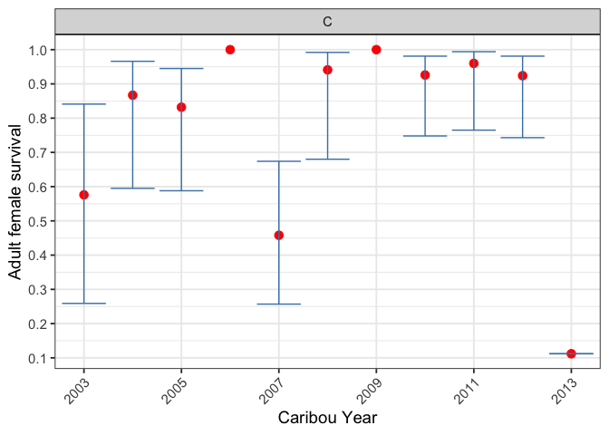
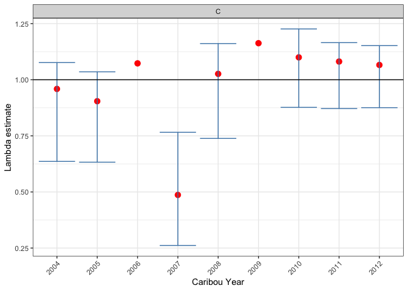
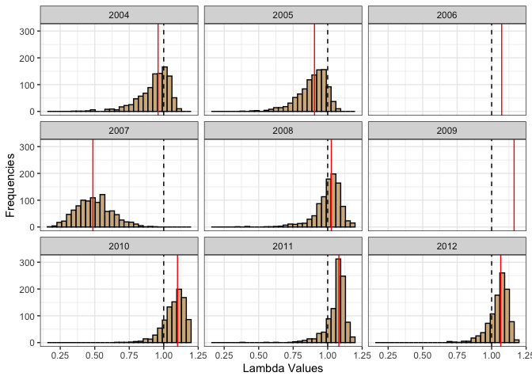

<!-- README.md is generated from README.Rmd. Please edit that file -->

<!-- # Copyright 2024 Province of Alberta -->

<!-- # -->

<!-- # Licensed under the Apache License, Version 2.0 (the "License"); -->

<!-- # you may not use this file except in compliance with the License. -->

<!-- # You may obtain a copy of the License at -->

<!-- # -->

<!-- # http://www.apache.org/licenses/LICENSE-2.0 -->

<!-- # -->

<!-- # Unless required by applicable law or agreed to in writing, software -->

<!-- # distributed under the License is distributed on an "AS IS" BASIS, -->

<!-- # WITHOUT WARRANTIES OR CONDITIONS OF ANY KIND, either express or implied. -->

<!-- # See the License for the specific language governing permissions and -->

<!-- # limitations under the License. -->

# bbouretro

<!-- badges: start -->

[](https://lifecycle.r-lib.org/articles/stages.html#stable)
[](https://github.com/poissonconsulting/bbouretro/actions/workflows/R-CMD-check.yaml)
[](https://app.codecov.io/gh/poissonconsulting/bbouretro?branch=main)
<!-- badges: end -->

## Introduction

The goal of bbouretro is to provide the ability to calculate survival,
recruitment and population growth using the traditional methods.

## Installation

To install the latest version from
[GitHub](https://github.com/poissonconsulting/bbouretro)

``` r
# install.packages("remotes")
remotes::install_github("poissonconsulting/bbouretro")
```

## Example

``` r
set.seed(101)

library(bbouretro)
library(bboudata)
#> 
#> Attaching package: 'bboudata'
#> The following object is masked from 'package:bbouretro':
#> 
#>     licensing_md

# generate recruitment estimate for each year
recruitment_est <-
  bbr_recruitment(
    bboudata::bbourecruit_c,
    adult_female_proportion = 0.65,
    sex_ratio = 0.5,
    variance = "bootstrap"
  )
bbr_plot_recruitment(recruitment_est)
```


``` r

# generate survival estimate for each year
survival_est <-
  bbr_survival(
    bboudata::bbousurv_c,
    include_uncertain_morts = TRUE,
    variance = "greenwood"
  )
bbr_plot_survival(survival_est)
```



``` r

# calculate lambda now that both recruitment and survival have been calculated
growth_est <- bbr_growth(survival_est, recruitment_est)
summary <- bbr_growth_summarize(growth_est)
summary
#> # A tibble: 9 × 13
#>   PopulationName CaribouYear     S     R estimate     se  lower  upper prop_lgt1
#>   <chr>                <int> <dbl> <dbl>    <dbl>  <dbl>  <dbl>  <dbl>     <dbl>
#> 1 C                     2004 0.867 0.096    0.959  0.115  0.636  1.08      0.323
#> 2 C                     2005 0.832 0.08     0.904  0.105  0.633  1.03      0.093
#> 3 C                     2006 1     0.068    1.07  NA     NA     NA        NA    
#> 4 C                     2007 0.458 0.059    0.487  0.128  0.262  0.766     0    
#> 5 C                     2008 0.941 0.083    1.03   0.1    0.739  1.16      0.615
#> 6 C                     2009 1     0.14     1.16  NA     NA     NA        NA    
#> 7 C                     2010 0.926 0.158    1.1    0.085  0.877  1.23      0.854
#> 8 C                     2011 0.96  0.112    1.08   0.075  0.872  1.16      0.861
#> 9 C                     2012 0.924 0.133    1.07   0.072  0.875  1.15      0.808
#> # ℹ 4 more variables: mean_sim_survival <dbl>, mean_sim_recruitment <dbl>,
#> #   mean_sim_growth <dbl>, median_sim_growth <dbl>
bbr_plot_growth(growth_est)
```



``` r
bbr_plot_growth_distributions(growth_est)
```



## bbou Suite

`bbouretro` is part of the bbou suite of tools. Other packages in this
suite include:

- [bboudata](https://github.com/poissonconsulting/bboudata)
- [bboutools](https://github.com/poissonconsulting/bboutools)
- [bboushiny](https://github.com/poissonconsulting/bboushiny)
- [bbousims](https://github.com/poissonconsulting/bbousims)

## Contribution

Please report any
[issues](https://github.com/poissonconsulting/bbouretro/issues).

[Pull requests](https://github.com/poissonconsulting/bbouretro/pulls)
are always welcome.

## Code of Conduct

Please note that this project is released with a [Contributor Code of
Conduct](https://contributor-covenant.org/version/2/0/CODE_OF_CONDUCT.html).
By contributing to this project, you agree to abide by its terms.

## Licensing

Copyright 2024 Province of Alberta  

The documentation is released under the [CC BY 4.0
License](https://creativecommons.org/licenses/by/4.0/)

The code is released under the [Apache License
2.0](https://www.apache.org/licenses/LICENSE-2.0)
